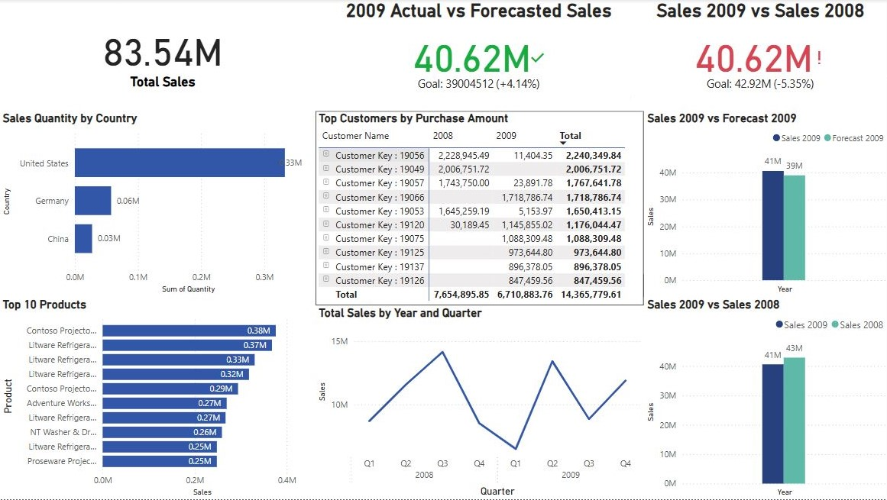

# Sales Data Analysis and Dashboard (Power BI)

This project features a one-page interactive dashboard built with Power BI to analyze tech product sales across 2008 and 2009.

## 📊 Project Highlights
- Built a complete data model linking Sales, Customers, Products, and Forecast datasets.
- Created a Date Table and DAX measures to calculate Total Sales, Year-over-Year Sales Comparison, and Forecast vs Actual Sales.
- Designed KPIs, Top Products, Top Customers, and Country-Level sales analysis.
- Enabled dynamic filtering with slicers (Country, State) and added drill-through functionality.

## 🖼️ Dashboard Preview

## 🛠️ Tools Used
- Power BI
- DAX
- Data Modeling

## 📂 Files
- `Sales_Dashboard.pbix` — Main Power BI dashboard file
- `README.md` — Project overview
- *(Optional)* Sample or anonymized datasets

## 🔍 How to View
Open the `.pbix` file in Power BI Desktop to explore the dashboard and data model.

---

*Note: Data used is for educational/demo purposes.*
